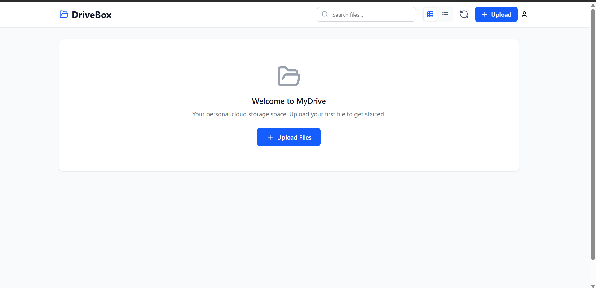

# 🌩️ safeCloud

**safeCloud** is a secure, AI-powered cloud storage web application built with the **MERN Stack**. Users can upload images, PDFs, and documents—and get an instant **AI-generated summary** of the content inside. Designed for both convenience and security, safeCloud includes full authentication, including **Google OAuth**, and stores files securely using **Cloudinary**.

---

## 🚀 Features

- 🔐 **User Authentication & Authorization**
- 🌐 **Google OAuth Integration**
- 📤 **Upload Images, PDFs & Documents**
- 🤖 **AI-Powered Summarization** using **Google Gemini**
- ☁️ **Cloud Storage Integration** with **Cloudinary**
- 🧾 **File Preview & Metadata Extraction**
- ⚡ Built with **MERN Stack** (MongoDB, Express, React, Node.js)
- ✨ UI animations powered by **Framer Motion**
- 📁 File upload handled by **Multer**

---

## 🛠️ Tech Stack

| Layer      | Technologies Used |
|------------|-------------------|
| **Frontend** | React, Redux, React Router DOM, Framer Motion |
| **Backend**  | Node.js, Express.js, Multer |
| **Database** | MongoDB Atlas |
| **AI**        | Google Gemini API |
| **Auth**     | JWT, Google OAuth |
| **Cloud Storage** | Cloudinary |

---

## 📸 Screenshots / Demo

---

## ⚙️ Setup Instructions

### 1. Clone the Repository

```bash
git clone https://github.com/yourusername/safeCloud.git
cd safeCloud
